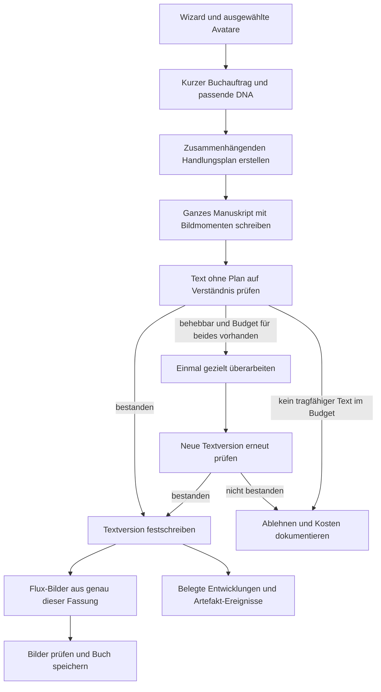

**Talea: verständliche Geschichten, belastbare Kosten, eine neue Buchwerkstatt**

Stand: 7. September 2026. Geprüft wurden der Repository-Stand `99ce65c`, die jüngsten Story-Änderungen einschließlich `3138e39`, beide DNA-Exporte und sämtliche Text- und Bildseiten von [Alexanders kniffliger Segelschlitten](../Logs/Alexanders_kniffliger_Segelschlitten_1788777096715.pdf). Der letzte Commit insgesamt betrifft Offline-Audio; er ist nicht die letzte Änderung an der Bilderbuch-Pipeline.

**Meine Bewertung: 2 von 10.** Gemessen an einem überzeugenden veröffentlichten Vorlesebuch für 6–8 Jahre. Das ist ein redaktionelles Urteil über diese eine Geschichte, kein statistisch ermittelter Durchschnitt deiner Plattform. Dein Eindruck ist nachvollziehbar: Der Text verlangt, dass die Zuhörenden fehlende Erklärungen ergänzen und Widersprüche übergehen. Mehr blumige Sprache würde daran nichts ändern.

| Bereich | Wert | Begründung am vorliegenden Text |
| --- | ---: | --- |
| Verständlichkeit | 2/10 | Schon der Einstieg erklärt Adrians Rolle und das Schlüsselproblem unzureichend. Später ist kaum noch vorstellbar, wer wo steht. |
| Ursache und Wirkung | 1/10 | Das Segel wird zerstört und treibt anschließend trotzdem eine Fahrt an. Personen und Fahrzeug wechseln ohne gezeigten Weg das Ufer. |
| Spannung | 2/10 | Eine Frist und eine Drohung sind vorhanden. Die Versuche haben aber keine zuverlässig verstehbaren Folgen. |
| Humor | 2/10 | Lautes Lachen und wiederkehrende Gesten werden behauptet. Die Situationen besitzen selten einen klaren komischen Aufbau. |
| Figuren und Mitgefühl | 2/10 | Zahnlücke, Mehlnase und Sprüche ersetzen weitgehend Beziehungen, Absichten und Reaktionen. |
| Vorlesesprache | 3/10 | Einzelne anschauliche Stellen; entscheidende Vorgänge werden durch Wortspiele und Vergleiche unklar. |
| Bild und Text zusammen | 2/10 | Die Bilder enthalten gerahmte Referenzporträts. Das zentrale Fahrzeug sieht von Bild zu Bild anders aus. |

Der Gesamtwert ist kein rechnerischer Mittelwert: Ein unverständliches Ende wiegt schwerer als einige gelungene Formulierungen.

**Die entscheidenden Fehler im Manuskript**

Auf Leseseite 2 springt Alexander an einer Boje ab. Worauf steht er nun? Woran ist das Seil befestigt, dessen Länge die Fahrt begrenzt? Beides muss man sich selbst zurechtlegen. Auf Seite 3 wandern die beiden Knoten vom Seil ins Segel. Auf Seite 4 soll das Drehen des Schlittens die Fahrtrichtung erklären: „jetzt war hinten vorn, und vorn war hinten“. Das klingt verspielt, beschreibt aber keine ausreichend klare Regel für die Bewegung zur Insel.

Der Schluss enthält mehrere voneinander unabhängige Brüche. Alexander und der Schlitten sind auf der Insel. Das Segel ist ausdrücklich noch ganz. Auf der nächsten Seite wird unvermittelt dessen „letztes Stück“ zerschnitten. Adrian steht am anderen Ufer, springt aber ohne Überführung auf genau diesen Schlitten. Der Wind bringt ihn trotz fehlenden Segels zur Insel. Danach stehen beide Kinder mit dem Fahrzeug am Ufer; die Rückreise fehlt. Auch eine magische Geschichte muss ihre eigenen Regeln erklären und einhalten.

Griselda droht mit der Verbrennung des Schlittens, ohne dass ihr Interesse verständlich wird. Wilhelm bietet Essen an und hält später ein Seil. Beide haben wenig Einfluss als eigenständige Personen. Adrian bekommt Eigenschaften und Gesten, aber kaum eine Entscheidung, die die Lösung ermöglicht. Die Drohung erzeugt deshalb eher Lärm als Spannung.

**Wie die vorhandene Pipeline diese Fehler begünstigt**

Die alte Bilderbuch-Pipeline enthält bereits gute Ansätze: ein begrenztes Textbudget, einen zusammenhängenden Schreibdurchlauf, eine Verständnisprüfung und wiederverwendbare Figuren. Diese Grundgedanken lassen sich übernehmen. Die folgenden Mechanismen würde ich verwerfen:

1. **Unabhängig ausgetauschte Handlungselemente.** Die Prämissenbank variiert Objekt, Schauplatz und Nebenwirkung separat. Im untersuchten Lauf treffen ein Segelschlitten, eine Wasserüberquerung, Seilknoten und ein ursprünglich zum Segel gehörendes Opfer zusammen. Der Plan muss nachträglich unvereinbare Voraussetzungen retten. Eine neue Situation sollte als zusammenhängendes Ereignis entstehen.
2. **Verbindliche Opfer und Gegner.** Das Schema verlangt unter anderem Gegenspieler, Eskalation und materiellen Preis. Daraus entsteht auch dort Zerstörung, wo eine freundliche Entdeckung oder eine kleine soziale Schwierigkeit die bessere Geschichte wäre. Nicht jede Geschichte braucht dieselbe Dramaturgie.
3. **Formale Stellvertreter für Verstehen.** Ein „denn“ beweist keine Ursache. Großgeschriebene deutsche Wörter beweisen keine neue Figur; die vorhandene Prüfung meldet auch gewöhnliche Substantive. Ein Text kann solche Prüfungen bestehen und trotzdem unmöglich sein.
4. **Die semantische Prüfung entscheidet nicht zuverlässig.** Im Log fällt der Verständnisprüfer durch. Die spätere Freigabe in [storybook-mode-generation.ts](../backend/story/storybook-mode-generation.ts) hängt jedoch von `finalReport.hard.length === 0` ab. Nach der Bearbeitung erfolgt keine neue vollständige Verständnisprüfung. Bilder können sogar noch bei einem verbliebenen harten Befund entstehen. Bei Fehlern bzw. unlesbarer Prüferantwort setzt [judge-stage.ts](../backend/story/storybook/judge-stage.ts) teilweise `passed: true`.
5. **Zu viel DNA ohne erzählerische Funktion.** Die alte Besetzung übernimmt nicht alle nützlichen Hintergründe, weist aber vorgegebene Rollen und Wünsche zu. So wird aus einer wiederkehrenden Person ein Lieferant von Sprüchen. Erscheinungsmerkmale gehören meist in die Illustration; im Text brauchen wir Absichten und Handlungen.

Auch „Standard“ und „Dev“ sind keine zwei vollständig verschiedenen Autoren: Der aktuelle Standardpfad verwendet den Dev-Kern und schaltet dessen harte Freigabe auf Warnungen. Mehr Varianten dieses Kerns lösen das Grundproblem nicht. Die neue Buchwerkstatt importiert keine alte Plan-, Schreib- oder Reparaturstufe.

Zwei weitere Probleme im gemeinsamen Plattformanschluss sind vor einer Veröffentlichung besonders relevant. `claimGenerationUsage` verbucht das Abo-Kontingent vor der KI-Arbeit; im Fehlerpfad von `generate.ts` folgt keine entsprechende Rückbuchung. Ein zurückgewiesener Qualitätsversuch kann daher Kontingent verbrauchen. Außerdem wird der Story-Kopf bereits auf `complete` gesetzt, bevor alle Kapitel einzeln gespeichert wurden. Diese Schreibvorgänge brauchen einen gemeinsamen erfolgreichen Abschluss. Beides betrifft den Betrieb und muss zusätzlich zum literarischen Kern gelöst werden; diese bestehenden Abläufe wurden hier nicht zu einem neuen Abrechnungssystem umgebaut.

**Die Kosten dieses Laufs sind bereits niedrig**

Quelle ist dein [Story-Export](../Logs/alexanders-kniffliger-segelschlitten-e4e9b41e-logs.json), nicht eine nachträgliche Modellpreisschätzung.

| Position | US-Dollar | US-Cent | Einordnung |
| --- | ---: | ---: | --- |
| Textaufgaben laut Abschluss der Bilderbuch-Pipeline | 0,017969 | 1,7969 | Sechs LLM-Aufrufe |
| Bilder im abschließenden Kostenbericht | 0,009060 | 0,9060 | Schätzung: sechs Bilder × 0,00151 USD |
| Gesamt laut abschließendem Bericht | 0,027030 | 2,7030 | Enthält gerundete Textkosten und geschätzte Bilder |

18.781 Tokens stehen 940 Wörtern Geschichte gegenüber; die Laufzeit beträgt rund 3 Minuten 40 Sekunden. Der reine Schreibaufruf kostet etwa 0,008963 USD. Planung, Prüfung, Bearbeitung, Entwicklungen und Bildprompts verbrauchen zusammen ungefähr noch einmal so viel. Das ist ein Ansatzpunkt für Vereinfachung, aber kein Beleg für einen Textkosten-Ausreißer über acht Cent in diesem Lauf.

Zwei Abrechnungsfehler sind belegt: Der Runware-Wrapper verwirft beim Bereinigen seiner Antwort auch `data[].cost`. Deshalb meldet die Bilderbuch-Stufe zunächst Bildkosten von null, bevor der gemeinsame Abschluss schätzt. Außerdem wird eine Rundungsdifferenz von 0,000001 USD ohne Tokens als zusätzlicher LLM-Aufruf „image-prompt-and-vision-qa“ erfasst. Dieser Eintrag belegt keine durchgeführte Bildprüfung. Der neue Adapter vermeidet diesen künstlichen Restaufruf; der gemeinsame Runware-Wrapper erhält jetzt Kostenfelder, ohne Bilder oder signierte URLs in die bereinigte Antwort aufzunehmen.

**Zehn ausgezeichnete Kinderbücher: Was Talea daraus lernen kann**

Eine objektive, für jedes Alter gültige „Top 10“ gibt es nicht. Als nachvollziehbare Referenz verwende ich die ersten zehn Titel der BBC-Culture-Abstimmung von 2023 mit 177 Beteiligten aus 56 Ländern; die Reihenfolge wurde über den [Bericht von ELTERN](https://www.eltern.de/familie-urlaub/bbc-umfrage--die-besten-kinderbuecher-aller-zeiten-13536732.html) geprüft. Die BBC-Seite war nicht direkt abrufbar. Darunter stehen Bilderbücher und lange Romane, also ausdrücklich keine einheitliche Leseliste für Fünfjährige.

Die folgende Technikanalyse ist meine Ableitung aus zugänglichen Auszügen, offiziellen Werkbeschreibungen und Autorenmaterialien. Ich habe für diese Untersuchung nicht zehn vollständige Bücher neu gelesen und keine erfundene Satzlängenstatistik erstellt. Die verlinkten Werkquellen belegen das Ausgangsmaterial; die Übertragung auf Talea ist mein Vorschlag.

| Rang und Werk | Erzählerische Technik | Konkrete Übertragung auf Talea |
| --- | --- | --- |
| 1. Maurice Sendak: **Wo die wilden Kerle wohnen** | Eine große Fantasiereise bleibt mit einem erkennbaren kindlichen Gefühl und der Rückkehr zur Geborgenheit verbunden. [Sammlungsbeschreibung](https://archive.fims.uwo.ca/specialcollections/items/show/338) | Vor der Magie klären: Was beschäftigt dieses Kind? Am Ende eine erfahrbare Antwort darauf zeigen. |
| 2. Lewis Carroll: **Alice im Wunderland** | Der Unsinn wirkt durch Alices ernsthafte Auseinandersetzung mit einer verdrehten Welt. [British Library](https://shop.bl.uk/products/alices-adventures-in-wonderland-through-the-looking-glass) | Wunderliche Einfälle brauchen eine nachvollziehbare Reaktion. Keine beliebigen Widersprüche als „Fantasie“ entschuldigen. |
| 3. Astrid Lindgren: **Pippi Langstrumpf** | Die ungewöhnlich selbstständige Heldin stellt erwachsene Erwartungen auf den Kopf. [Offizielle Werkseite](https://www.astridlindgren.com/gb/pippi-langstrumpf-900317) | Das Kind darf ausprobieren, widersprechen und überraschen. Handlungsmacht ist mehr als der eigene Name im Text. |
| 4. Antoine de Saint-Exupéry: **Der kleine Prinz** | Beziehungen werden an konkreten Begegnungen und Dingen erfahrbar. [Offizielle Buchseite](https://www.lepetitprince.com/en/the-book/) | Ein Versprechen, eine vermisste Person oder ein sorgsam behandeltes Ding trägt Gefühle besser als eine abstrakte Moral. Die philosophische Dichte nicht pauschal übernehmen. |
| 5. J. R. R. Tolkien: **Der Hobbit** | Ein zunächst wenig heldenhafter Reisender wächst in Anforderungen hinein. [Tolkien Estate](https://www.tolkienestate.com/writing/john-d-rateliff-the-hobbit/) | Das Kind muss die Lösung nicht sofort kennen. Ein konkreter Versuch verändert sein Verständnis und ermöglicht den nächsten. Keine Romanwelt in 600 Wörter pressen. |
| 6. Philip Pullman: **Der goldene Kompass** | Entdeckungen und offene Fragen treiben eine große Geschichte voran. [Autorenseite](https://www.philip-pullman.com/hdm) | Eine interessante Frage offenhalten, während die aktuelle Szene verständlich bleibt. Komplexe Hintergründe und düstere Stoffe für ältere Zielgruppen reservieren. |
| 7. C. S. Lewis: **Der König von Narnia** | Ein konkreter Zugang führt aus dem Alltag in eine andere Welt; Entscheidungen haben Folgen. [Offizielle Buchseite](https://www.cslewis.com/uk/books/format/the-lion-the-witch-and-the-wardrobe-the-chronicles-of-narnia-book-2/9780007222865/) | Übergänge zwischen Orten zeigen. Neue Regeln beim Erleben einführen. Ein Portal ersetzt keine Orientierung. |
| 8. A. A. Milne: **Pu der Bär** | Humor entsteht aus Pus ernsthaftem, eigennützigem Denken und dem liebevollen Umgang damit. [Verlagsauszug](https://www.simonandschuster.com/books/Winnie-the-Pooh/A-A-Milne/The-Winnie-the-Pooh-Collection/9781665947688) | Eine Figur denkt plausibel aus ihrer Sicht, während das Kind einen Irrtum bemerkt. Dafür braucht sie einen eigenen Wunsch, keine Witze-Quote. |
| 9. E. B. White: **Wilbur und Charlotte** | Fürsorge und konkrete Handlungen machen Freundschaft bedeutsam; Enthüllungen werden szenisch vorbereitet. [Verlag mit Auszug](https://www.penguin.co.in/book/charlottes-web/) | Eine Figur hilft so, dass sich die Lage tatsächlich ändert. Ein überraschendes Ergebnis zuerst wahrnehmbar werden lassen. |
| 10. Roald Dahl: **Matilda** | Kindliche Fähigkeiten stehen überzeichnetem Machtmissbrauch gegenüber. [Offizielle Werkübersicht](https://www.roalddahl.com/stories) | Das Publikum muss verstehen, was unfair ist. Die Antwort der Hauptfigur braucht Einfallsreichtum und Wirkung; die Härte wird altersgerecht angepasst. |

Am Pu-Auszug lässt sich der Unterschied besonders gut sehen: Geräusch, Bienen, Honig und Klettern bilden eine verständliche Gedanken- und Handlungskette. Die komische Verzerrung liegt in Pus Überzeugung, der Honig existiere für ihn. Beim Ballonversuch erkennt das zuhörende Kind den misslungenen Tarnversuch, während Pu daran festhält. Sogar das Herunterkommen wird als konkretes Problem gelöst. Talea braucht diese Verbindung von Wunsch, Irrtum und Folge; nicht dieselben Bienen oder denselben Ballon.

Für den jüngeren Teil deiner Zielgruppe sind außerdem **Der Grüffelo** und **Die kleine Raupe Nimmersatt** nützliche Gegenproben. Julia Donaldsons eigene Kursunterlagen behandeln Muster, Wiederholung, deren gezielte Abweichung und kindgerechte komische Überraschungen. Das Carle Museum beschreibt die Verbindung der Raupengeschichte mit Zählen, Wochentagen und Verwandlung. Meine Ableitung: Wiedererkennen kann ein Vergnügen und eine Verständnishilfe sein. Der alte Codekommentar, ein Kind höre bei erkannter Wiederholung nicht mehr zu, ist als pauschale Gestaltungsregel ungeeignet. [Donaldsons Kursunterlagen, besonders S. 49 und 56–58](https://assets.cdn.bbcmaestro.com/julia-donaldson-writings-childrens-picture-books-course-notes-v2.pdf), [Carle Museum](https://carlemuseum.org/about/about-eric-carle/picture-book-career).

Aus diesen Büchern würde ich allgemeines Handwerk übernehmen: klare Wünsche, eigenwillige Figuren, erkennbare Folgen, vorbereitete Überraschungen, Rhythmus und ein befriedigendes Ende. Die produktiven Prompts enthalten keine Aufforderung, einen bestimmten Autor oder dessen Formulierungen nachzuahmen.

Die wichtigste zusätzliche Investition wäre redaktionelle Arbeit **vor** den Kundenaufrufen: ein kleiner Bestand eigener, vollständig durchgearbeiteter Beispielgeschichten mit erläuterten Stärken und Fehlern, abgestimmt auf Alter und Erzählform. Damit lassen sich Modelle und Lektoren kalibrieren und später bei Bedarf kurze passende Beispiele bereitstellen. Zusammenhängende, geprüfte Situationen können als Ausgangspunkt dienen; unabhängig austauschbare Mechanismen dürfen daraus nicht wieder werden. Diese einmalige Entwicklungsarbeit verteilt sich auf viele Geschichten. Ein Drei-Cent-Budget pro Generierung bedeutet nicht, dass auch die gesamte Produktentwicklung ohne ein redaktionelles Budget auskommen kann. Der neue Kern enthält noch keinen solchen kuratierten Qualitätsbestand.

**So würde ich von Anfang an bauen**



Die letzte visuelle Prüfung ist Bestandteil des Zielsystems. Im implementierten Kandidaten werden bisher die Bildbeschreibungen gegen den Text geprüft; echte Bildausgaben besitzen ausdrücklich den Status `not-visually-reviewed`.

**1. Ein kurzer Buchauftrag.** Alter, Sprache, Länge, Genre, Ton, Lernwünsche und alle ausgewählten Avatare sind Eingaben. Dazu kommen wenige passende Figuren und höchstens ein nutzbares Artefakt. Vier Kinder brauchen vier erkennbare Beiträge, aber nicht vier Nebenfiguren, vier magische Objekte und vier komplette Lebensläufe. Kein ausgewählter Avatar wird still entfernt. Der aktuelle Wizard begrenzt die Auswahl auf vier; der Kern berücksichtigt auch größere Besetzungen und reduziert dann zuerst Nebenrollen.

**2. Ein zusammenhängender Plan.** Hauptwunsch, Bedeutung, Hindernis, Orte, gegebenenfalls eine Weltregel und pro Leseseite Handlung, Ursache und Ergebnis. Die Schlusslage muss auch Besitz und Aufenthaltsorte klären. Eine Entdeckungsgeschichte kann über Neugier funktionieren; ein Einschlafbuch über ein kleines Bedürfnis und zunehmende Ruhe. Eine Abenteuerhandlung darf stärkere Versuche und Rückschläge haben. Der Plan braucht keine Pflichtfelder für irreversible Schäden.

**3. Ein Autor schreibt das gesamte kurze Buch.** Ein Durchlauf kann Vorausdeutungen und Rückbezüge überblicken. Bildmomente werden als kurze Zusatzfelder mitgeliefert. Keine separaten kostenpflichtigen Schreibaufrufe für jedes Kapitel, jedes Stilmerkmal, jeden Witz und jeden Bildprompt. Kein automatisches Glätten jedes Satzes: Dabei können charakteristische Stimmen verschwinden.

**4. Ein unabhängiges Modell liest ohne Plan.** Es beantwortet vier Fragen mit wörtlichen Belegen: Was will das Kind? Was steht im Weg? Warum funktioniert die Lösung? Wie endet es? Hinzu kommen konkrete Kontinuitätsfehler, Stimmen, Vorlesbarkeit, tatsächliche Beiträge aller Avatare und die Wünsche aus dem Wizard. Ein Prüferfehler ist keine Freigabe. Die Software kontrolliert, ob Zitate vorhanden sind; ob sie inhaltlich überzeugen, bleibt zunächst eine Modellentscheidung und muss durch menschliche Vergleichsurteile kalibriert werden.

**5. Höchstens eine Überarbeitung, mit neuer Prüfung.** Eine einzelne korrigierte Seite kann die spätere Handlung verändern. Deshalb wird das kurze Manuskript als zusammenhängende Fassung bearbeitet. Vorher muss Budget für Bearbeitung und erneute Prüfung vorhanden sein. Danach gilt ausschließlich das neue Urteil über den neuen Text. Die akzeptierte Fassung erhält einen Hash; Bilder verwenden genau diese Version. Kein unkontrollierter Textaustausch danach.

**6. Bilder und Entwicklungen folgen der Geschichte.** Erst jetzt entstehen Flux-Aufträge. Der Lektor liefert im selben Aufruf belegte Entwicklungen; dadurch entfällt eine weitere Textstufe. Die bestehenden neun Grundtraits, Beschreibungen und MCP-Validierung bleiben erhalten. Bei fehlgeschlagener MCP-Prüfung vergibt die neue Route keine ungeprüften Veränderungen.

**Alle Altersgruppen, verschiedene Anforderungen**

Die folgenden Wortbereiche sind vorläufige Produktparameter für Taleas digitales Bilderbuchformat, keine wissenschaftlichen Normen und keine Aussage über sämtliche gedruckten Kinderbücher. Die Implementierung bietet 6/8/10 Leseseiten für kurz/mittel/lang und prüft die gesamte Wortzahl; einzelne Seiten dürfen unterschiedlich lang sein.

| Wizard-Alter | Mittlere Länge | Redaktionelles Ziel |
| --- | --- | --- |
| 3–5 | 240–440 Wörter | Ein gut greifbarer Wunsch, wenig gleichzeitiges Geschehen, sichtbare Folgen, überschaubare Anspannung. |
| 6–8 | 480–760 Wörter | Eigene Versuche, unterscheidbare Stimmen, vorbereiteter Humor, klarer Schluss. |
| 9–12 | 720–1.080 Wörter | Mehr Zwischentöne, Eigenständigkeit und anspruchsvollere Fragen; weiterhin vollständige Kausalität. |
| 13+ | 960–1.440 Wörter | Keine Babysprache, mehr Ambivalenz, altersgerechte Themen und Perspektive. |

Die Altersgruppe wird aus dem Wizard erhalten. Ebenso die sieben vorhandenen Sprachen, falsche Boolean-Werte und Intensität null. Eine ruhige Geschichte ohne Humor darf nicht an einer Abenteuer- oder Witzvorgabe scheitern. Lerninhalte brauchen fachlich überprüfte Bausteine, wenn belastbare Wissensvermittlung versprochen wird; ein preiswertes Sprachmodell allein ist dafür keine verlässliche Faktenquelle.

**Figuren, Artefakte und Bilder: Was ich übernehmen würde**

Der Figurenexport enthält 128 Einträge, aber nur 89 unterschiedliche Namen. 39 Namen kommen doppelt vor; 39 Einträgen fehlt eine Hintergrundgeschichte. Das ist keine Aufforderung, 39 Datenbankzeilen blind zu löschen. Der neue Katalog wählt pro gleichem Namen deterministisch die reichhaltigere Fassung als Kandidat. Vorhandene IDs, Bilder und Besitzdaten werden nicht zusammengeführt. Eine spätere redaktionelle Bereinigung muss tatsächliche Identitäten und Verweise prüfen.

Übernehmen würde ich pro Figur: Identität, kanonisches Aussehen, eine Motivation, wenige Hinweise auf ihre Stimme und eine Eigenheit. Für einen konkreten Auftritt wird daraus eine Absicht. Wilhelm kann beispielsweise wollen, dass niemand hungrig zum Fest geht. Dann ergibt sich sein Handeln aus ihm selbst. Ein vorformulierter Frühstücksspruch muss nicht in jede Geschichte.

Der Artefaktexport enthält 81 Datensätze, davon 80 aktive nutzbare Einträge; `test_001` ist ausdrücklich deaktiviert. Nützlich sind besonders die Grenzen der Fähigkeiten: Ein Kompass kann eine Richtung zeigen, ohne die ganze Aufgabe zu lösen. Ein Wunschbuch darf nicht plötzlich vollständige Lösungen liefern, wenn seine DNA nur ein Wort erlaubt. Ein mitgebrachtes Artefakt ist verbindlich und wird auf Besitz geprüft. Ein neu angebotenes Artefakt darf der Plan ablehnen. Die Schatzkammer darf die Erzählung bereichern, ohne jede Alltagsszene in eine Fundquest zu verwandeln.

**Flux bleibt `runware:400@4`.** Die neue Bildstufe verwendet direkt die Referenzen der tatsächlich sichtbaren Figuren, bis zu vier Referenzen insgesamt; ein Artefakt erhält eine Bildreferenz, wenn dafür Platz bleibt. Keine neue mehrfarbige Porträtcollage als Eingabe. Jeder Auftrag beschreibt einen Moment der freigegebenen Seite und den aktuellen Zustand wichtiger Dinge. Das erste Seitenbild kann als Cover dienen. Zwei Aufträge laufen gleichzeitig; ein fehlgeschlagener Versuch wird nicht automatisch mit neuer Kennung erneut bezahlt. Modell und Referenzgrenze sind in der [Runware-Dokumentation](https://runware.ai/docs/models/bfl-flux-2-klein-4b) beschrieben.

Das entfernt die problematische Collage-Eingabe, garantiert aber noch keine korrekten Bilder. Vor der Veröffentlichung der neuen Route fehlen echte Flux-Vergleichsläufe und eine visuelle Abnahme auf Figurenidentität, Rahmen, falsche Requisiten und Textwidersprüche. Für das Zielsystem würde ich eine günstige Bildprüfung mit klar begrenzter Wiederholung vorsehen. Außerdem braucht der PDF-Export eine bewusste Buchgestaltung: Im geprüften Dokument stehen kleine quadratische Bilder über relativ großen Textblöcken mit viel ungenutzter A4-Fläche. Die sichtbaren Umlaute sind korrekt; ungewöhnliche Zeichen bei der Textextraktion sind kein belegter Fehler im gerenderten PDF.

**Ein wirtschaftlicher Modellplan**

Mein erster Vergleichskandidat ist Kimi K2.6 für die Prosa und GPT-5.6 Luna für Planung und Lektorat. Das ist eine zu prüfende Auswahl, kein erwiesener Sieger für deutsche Kinderliteratur. Eine günstigere Variante lässt Luna schreiben und verwendet ein anderes Modell für die Prüfung. Die Auswahl sollte durch blind bewertete Texte fallen, nicht durch Anbieter-Ranglisten.

Geprüfte Preisquellen am 7.9.2026: [OpenAI Luna](https://developers.openai.com/api/docs/models/gpt-5.6-luna) nennt 0,20 USD je Million Eingabetokens und 1,20 USD je Million Ausgabetokens. [OpenRouter Kimi K2.6](https://openrouter.ai/moonshotai/kimi-k2.6) zeigt anbieterabhängige Preise; der Kandidat setzt 0,70/3,50 USD als Obergrenzen. Niedrigere Sondertarife werden nicht vorausgesetzt. Die Requests begrenzen den Anbieterpreis über [OpenRouters `max_price`](https://openrouter.ai/docs/guides/routing/provider-selection).

Ein **Rechenbeispiel, keine Messung** für ein mittleres Buch:

| Aufgabe | angenommene Eingabe-/Ausgabetokens | Kosten mit diesen Preisen |
| --- | ---: | ---: |
| Plan mit Luna | 2.500 / 1.000 | 0,001700 USD |
| Prosa und Bildmomente mit Kimi | 3.000 / 2.400 | 0,010500 USD |
| Lektorat und Entwicklungen mit Luna | 4.000 / 1.400 | 0,002480 USD |
| Summe ohne Überarbeitung | | **0,014680 USD = 1,468 US-Cent** |

Das lässt Spielraum, ist aber keine Zusage „jedes Buch unter drei Cent“. Lange Texte, viele Figuren, andere Sprachen, teure Wizard-Modelle und Reparaturen erhöhen den Aufwand. Manche Kombinationen müssen mit dem gewählten Limit abbrechen. Der Kandidat hat standardmäßig 0,03 USD Textbudget und höchstens fünf Aufrufe. Die Vorabreservierung ist bewusst konservativ; deshalb kann eine Reparatur abgelehnt werden, obwohl ihre tatsächlichen Kosten später möglicherweise niedriger wären. `reasoning.exclude` allein spart keine Denktokens; unterstützte Reasoning-Einstellungen und das gesamte Ausgabelimit müssen zusammenpassen. [OpenRouter zu Reasoning-Kosten und Modelloptionen](https://openrouter.ai/docs/guides/best-practices/reasoning-tokens).

Für ein Abo zählt **Summe sämtlicher Textversuche geteilt durch Zahl akzeptierter Geschichten**. Beispiel: Werden nur 80 % der Versuche akzeptiert und kostet jeder durchschnittlich 1,5 Cent, kostet eine akzeptierte Geschichte im Mittel 1,875 Cent. Bilder, Audio, Speicherung, Zahlungsgebühren, Steuern und Betrieb kommen separat dazu. USD und Euro dürfen nicht gleichgesetzt werden. Eine teure Modellauswahl braucht einen eigenen Tarif oder ein sichtbar anderes Limit.

**Was bereits im Repository umgesetzt ist**

Der neue Kandidat liegt in [backend/story/book-workshop](../backend/story/book-workshop/engine.ts), der Anschluss an die Plattform in [book-workshop-generation.ts](../backend/story/book-workshop-generation.ts). Hinzu kommen strenge JSON-Verträge, DNA-Normalisierung, Budgetreservierung, getrennte Kostenherkunft, ein eigener OpenRouter-Transport, die Flux-Stufe und ein lokales Prüfwerkzeug. Die bisherigen drei Engines bleiben als Vergleich erhalten.

Aktivierung ausschließlich im Bilderbuchmodus über `TALEA_STORYBOOK_ENGINE=book-workshop-v1`; ohne diese Variable läuft der bisherige Bilderbuchpfad. Es wurde keine Produktionskonfiguration verändert und nichts deployed. Der Kandidat routet Textaufrufe derzeit über OpenRouter, auch wenn eine native Wizard-Modellbezeichnung übersetzt wird. Native Anbietertransporte und jede einzelne Modellkennung sind damit noch nicht Ende zu Ende geprüft. Unbekannte Modelle brauchen vor dem ersten Textaufruf einen verfügbaren Preis; es gibt keinen stillen Modellwechsel.

Lokale Nutzung aus dem Projektverzeichnis:

```powershell
bun run scripts/book-workshop.ts audit
bun run scripts/book-workshop.ts generate --input docs/book-workshop-example-input.json
bun test backend/story/book-workshop/book-workshop.test.ts
```

Der zweite Befehl ist standardmäßig ein kostenloser Trockenlauf. Für einen echten Textversuch muss ein gültiger lokaler OpenRouter-Schlüssel konfiguriert sein:

```powershell
bun run --env-file=.env.railway scripts/book-workshop.ts generate --input docs/book-workshop-example-input.json --live --budget 0.03
```

Dieses CLI erzeugt keine Bilder und schreibt nicht in die Datenbanken. Ergebnisse enthalten Manuskript, Urteil, Belege und Kostenherkunft. `providerTextCostUSD` sind gemeldete Kosten, `estimatedTextCostUSD` Token-Schätzungen, `reservedUnknownUSD` vorsorglich gebundenes Budget bei unklarem Ausgang. Reservierungen werden nicht als gemessener Verbrauch ausgewiesen.

Der hier versuchte Live-Lauf wurde schon beim ersten Aufruf mit **HTTP 401** abgewiesen. Somit gibt es noch keine neu gemessene Storyqualität, Durchlaufzeit oder reale Kosten einer erfolgreichen Buchwerkstatt-Geschichte. Ein erfolgreicher Mock-Test ersetzt diese Messung nicht. Der [eigene Mustertext](book-workshop-example-story.de.md) zeigt eine redaktionelle Richtung und ist ausdrücklich kein Output der günstigen API-Pipeline.

**Was vor einer breiten Freigabe noch nachgewiesen werden muss**

Bestanden: **34 Tests des neuen Kerns, 43 bestehende Bilderbuchtests und 25 Prüfungen der vorhandenen Bildpipeline**. Sie prüfen unter anderem fehlerhafte und abgeschnittene Antworten, bezahlte Fehlversuche, fehlende Prüfungen, Widerspruchssperren, neue Prüfungen nach Überarbeitung, Avatarbeiträge, Elternvorgaben und Bildkosten. Ein Vergleich des gesamten Backend-Typechecks mit einer virtuellen unveränderten HEAD-Fassung ergibt dieselben 52 bestehenden TypeScript-Diagnosen und keine hinzugekommenen. Das Backend hat damit weiterhin keinen insgesamt fehlerfreien Typecheck.

Mein nächster Abnahmeschritt wäre ein fester Satz von zunächst 24 Konfigurationen: alle vier Altersgruppen, alle Längen und ein bis vier Avatare; dazu ausgewählte Kombinationen aus Sprachen, Einschlafgeschichte, Abenteuer, Humor null, starkem Humor, Lernziel und mitgebrachtem Artefakt. Diese 24 Fälle decken nicht jede Kombination ab. Ergänzende automatisierte Konfigurationstests und wiederholte Stichproben sind nötig. Mindestens zwei Modellvarianten bekommen identische Aufgaben; bestehende und neue Texte werden ohne Modellnamen bewertet.

Für die literarische Abnahme braucht es einen Kinderbuchlektor bzw. eine entsprechend erfahrene Person und freiwillige Vorleserunden mit Kindern der jeweiligen Altersgruppe. Nach dem Hören reichen zunächst vier offene Verständnisfragen. Zusätzlich festhalten: Wo wurde nachgefragt? Welche Stelle war lustig? Wollte das Kind weiterhören? Was konnte es nacherzählen? Humor lässt sich nicht allein am hörbaren Lachen und Verstehen nicht allein an einem Modellscore messen. Vorgeschlagene Produktziele sind mindestens drei von vier verstandene Kernfragen, kein ungeklärter zentraler Logikbruch und eine klare Präferenz gegenüber der alten Route. Das sind Abnahmekriterien, keine bereits erreichten Ergebnisse.

Für den Betrieb bleiben zusätzliche Aufgaben: dauerhafte Speicherung erfolgreicher Stufen vor Bildern, Wiederaufnahme nach Prozessabbruch, ein verlässlicher Auftragsstatus für Bilder, Kostenabgleich unklarer Anbieterantworten und überprüfbare Artefakt-Buchungen. Die bestehenden Artefakt-Helfer melden Datenbankfehler nur als Warnung; eine erfolgreiche Rückkehr beweist dort keine erfolgreiche Buchung. Stabile Bildkennungen allein garantieren keine Idempotenz des Anbieters. Diese Grenzen müssen vor einer breiten Aktivierung geschlossen werden. Das aktuelle Opt-in und der Vergleichsstand machen die Arbeit prüfbar, ohne eine unbewiesene Kinderbuchqualität als fertig auszugeben.
